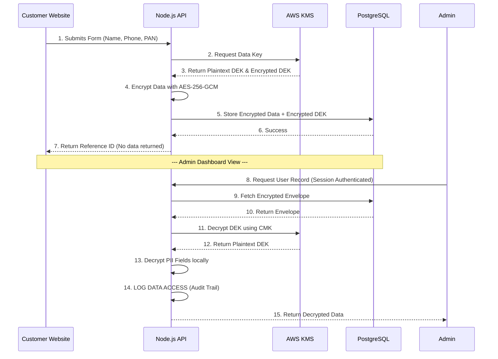

# Borrowww Security Architecture & Data Compliance

## Overview
This document outlines the security architecture, data handling practices, and technical stack implemented for the Borrowww platform. These measures are designed to meet stringent banking compliance requirements (PCI-DSS, SOC2, and DPDP Act) to ensure maximum protection of sensitive customer data.

---

## Technical Stack
| Component | Technology | Purpose |
|-----------|------------|---------|
| **Backend** | Node.js (Express.js) | High-performance, scalable API server |
| **Database** | PostgreSQL | Robust relational data storage with ACID compliance |
| **ORM** | Prisma | Typesafe database access and schema management |
| **Authentication** | express-session + connect-pg-simple | Secure, server-side session management |
| **Encryption** | AWS KMS (Envelope Encryption) | Banking-grade data protection |
| **Security Headers** | Helmet.js | Prevents common web vulnerabilities (XSS, Clickjacking) |

---

## 1. Advanced Data Encryption (AWS KMS)
We use **AWS Key Management Service (KMS)** with an **Envelope Encryption** pattern to protect Personally Identifiable Information (PII) at rest.

### The Envelope Encryption Flow:
1. **Key Generation**: For every unique encryption operation, the server requests a unique **Data Encryption Key (DEK)** from AWS KMS.
2. **Double Wrapping**: 
   - The data is encrypted locally using the DEK with **AES-256-GCM** (Authenticated Encryption).
   - The DEK itself is encrypted by the **AWS KMS Customer Managed Key (CMK)**, which never leaves AWS hardware.
3. **Storage**: We store the *Encrypted Data* and the *Encrypted DEK* together in the database.
4. **Security Advantage**: Even if the database is compromised, the data remains unreadable because the decryption key (CMK) is safely locked inside AWS KMS with restricted IAM permissions.

---

## 2. Secure Authentication Architecture
We have transitioned from JWT (JSON Web Tokens) to **Server-Side Session Authentication** for the Admin Dashboard to enhance security.

### Why Sessions over JWT?
- **Immediate Revocation**: Sessions can be invalidated server-side instantly (e.g., if a laptop is stolen). JWTs are stateless and harder to revoke before they expire.
- **XSS Protection**: Session IDs are stored in **HTTP-only cookies**, meaning they cannot be accessed by malicious JavaScript.
- **Secure Transport**: Cookies are marked as `Secure` to ensure they are only sent over HTTPS.
- **SameSite Protection**: Cookies use `SameSite=Strict` to prevent Cross-Site Request Forgery (CSRF).

---

## 3. Production Data Safety & Compliance
In banking systems, data integrity and availability are critical.

### Soft Delete Pattern
- **No Permanent Loss**: We use a `soft delete` mechanism. When a record (User, Inquiry, etc.) is "deleted," it is marked as `isDeleted: true` with a `deletedAt` timestamp.
- **Audit Requirement**: This ensures we fulfill compliance requirements to retain financial records for audit purposes while removing them from the active UI.

### Production Deletion Guard
A specialized middleware (`prodSafety.js`) is active in production:
- **Blocks Bulk Deletes**: `deleteMany` operations are strictly blocked to prevent accidental mass data loss.
- **Enforces ID-Only Deletion**: Only single records can be deleted using their explicit ID, forcing intentionality.

---

## 4. Audit Logging & Monitoring
Transparency is a core requirement for banking partners.
- **Data Access Auditing**: Every encryption, decryption, and admin access operation is logged with a timestamp, action type, model name, and the Admin ID responsible for the action.
- **Access Control (RBAC)**: Only authenticated Admins with active accounts can trigger decryption.
- **PII Protection**: Sensitive fields like Name, Phone, Address, and PAN/Aadhaar are NEVER stored or returned in plaintext to the client website.

---

## 5. End-to-End Data Flow

---

## Summary of Protected Models
The following entities have zero-plaintext storage for sensitive fields:
- **Users**: Identity details, address, contact info.
- **CIBIL Data**: Credit reports, PAN numbers.
- **Credit Inquiries**: Submission details.
- **Home Loan Inquiries**: Financial and personal data.
- **Referral Inquiries**: Contact details of both parties.
- **Contact Inquiries**: Message content and sender info.
